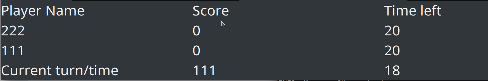
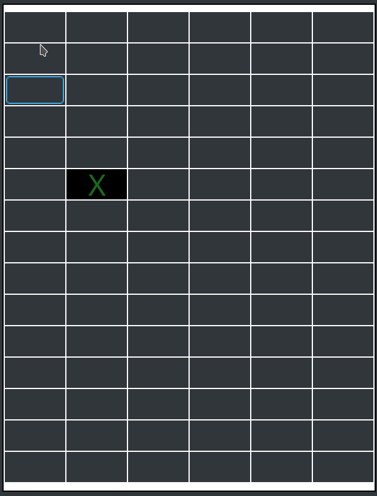
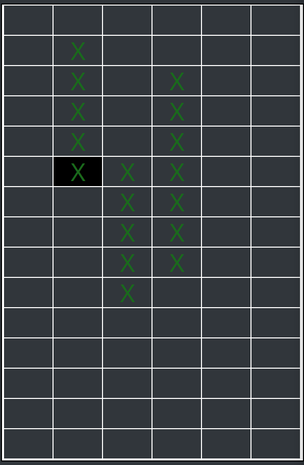
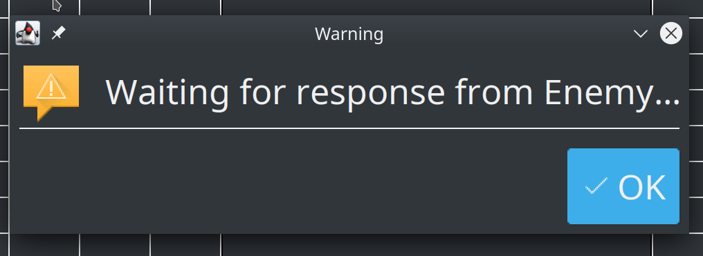

# Manual  

This is the user manual of BattleShip Game.  
You may find detail program usage and error message explanation here.

# GUI

## Starting GUI

To start GUI, follow the command in `README.md`. It may take a while for the application window to show.

## Basic Steps

### Set up a Server

In order to start a game, first a server needed to be set up.

Choose server mode and enter all necessary information. Then the server side will notice await client connection. 

Then, open up another program with Client mode. Here is an example of information will be asked when starting program as client

#### Player name limitation 

Player name can now only use character in a-zA-Z0-9 with length 1-20. Program will repeatedly ask for info if standard not met.

Right now, the server and the client may have the same player name. **It is recommended that different name used during game play**

#### Network Issue

However, if you enter wrong network information (address/port). The program will fail and exit

### Main Frame

When client and server finished syncing, the main frame will be shown as following.

The left board will be self player board, where ship will be set using it. The right board will represent enemy's board and self player will hit target using that board.

#### Set Ship

In order to get started, both player needs to set up the ships on their board first. To set ship, click on any cell where you would like the ship to have. The cell you clicked will be the head of the ship. 

There will be two follow-up dialogs allows you to:

- choose which ship to add
- choose ship direction

After setting a ship, board will show the corresponded cell using 'X' sign. In order to remove a ship from the location, click the cell with 'X' sign, and it will remove the ship at that location. The cell does not necessary to be the head of the ship.

When all ships are set, any further clicks will bring to the following:

#### Start the turn

Once you are ready, click on the ready button on the left. Once both side are ready, the following notice will appear: 

Now the game has officially started. The turn and time will be shown on the status board below

When it is your turn, click on the enemy board that haven't been discovered, and if there is a ship, an 'X' will show on the cell.

And on the enemy point of view, they will see the block discovered like the following:

The win condition will be:

- The first player revealed all enemy's ship
- The enemy didn't make a move during given time frame

Once one of the conditions is met, a result page will show and both players can decide whether to move to next game or not. The first player click the next game will be prompted the following:

Once the enemy decided next game, click on OK to move start the new game.

### Configuration 

You may change the UI of the application by editing configuration. To open configuration panel, you may use the `Settings` button on the toolbar, or the `Configuration` button under `Actions` menu. 

Please do not edit settings during game turn.

Notice: 

- **`Grid Size` and `Time Limit` will be sync from the server if program started with client mode.**
- All changes will take effective after program restart 

#### Colors

You may change the color of based on cell status, and the text/mark color over it. Simply click the color blocks on the right column, and a color chooser will appear. 

Once you have decided a color, click ok, and you may find the map appear changed at the same time.

Notice: **All color configuration won't be sync with the client**

#### Time limit per round 

Time (in second) each move needs to be done. Min second allowed is 5.

#### Grid Size

The size of the grid. When clicked, a dialog will prompt current settings, and you may change at this point. Row and col must be larger than 0, and the total number of cell must be at least 17 so that all ships can fit in the grid.

---

Once you have finished set up, you may close the configuration by clicking X on the top right. **Your changes will be saved immediately after you have changed the value. For text field, please press ENTER to confirm your decision.**

### Typing and number

For input box accept a number. **Please press enter to confirm** and if the input given cannot be parsed as a valid number, a warning will be given. Please double check your input and try again.

## Error Messages

Here are some examples of the error messages

- Ship overlapped 
    - When set the ship, there are another ships already block the way. Please double check your input
- Please wait for your turn
    - When you click the enemy board when it is not your turn, this warning will be given
- Invalid Coordinate
    - Some part of the ship will be out of the map range, please double check your input

### Limitations

Currently, there are some limitation/inconsistency you may find during game play

#### Unstable network

This game currently does not tolerate any network issue including latency larger than 2 seconds. You may find game behave abnormally if using under bad network condition

#### Client/Server Exit

If either Client/Server exited during game play, the other side won't be notified, and their game will freeze. 

#### Starting game

The starting notice mentioned above **may postponed for around 3 seconds after both side are ready due to be some final data synchronization and time frame adjustment.** 

#### Notification

Please dismiss any Dialog as quick as possible, as it may block the game process. Failed to do so may lead the game out of sync. 

#### Time count

Currently, time limits are counted by the players themselves. There may be around 1-2 seconds display delay, but the real time count should still be correct.

### Long initialization time

When the program is generating maps (new map), it might be slow to response. Please be patient. 

The suggested size of the map is no larger than (30x30)
