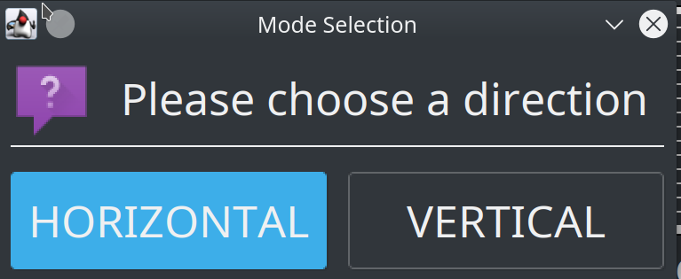
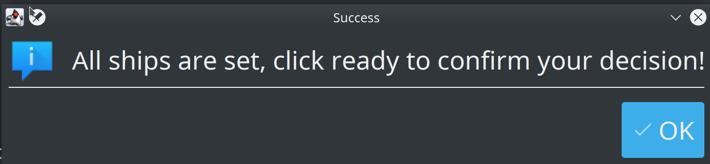
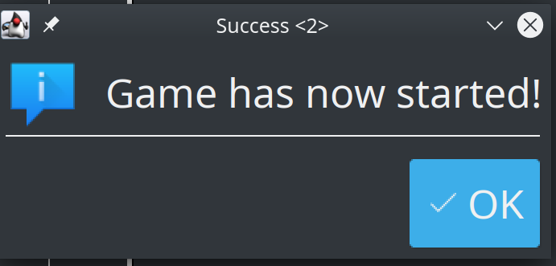

# Manual 
 
This is the user manual for BattleShip Game. 
You may find detail program usage and error message explanations here.
 
# GUI
 
## Starting GUI
 
To start GUI, follow the command in `README.md`. It may take a while for the application window to show.
 
## Basic Steps
 
### Set up a Server
 
In order to start a game, first a server is needed to be set up.
 

 
Choose server mode and enter all necessary information. Then the server side will await client connection.
 
Then, open up another program with Client mode. Here is an example of that will be asked when starting the program as a client.
 

 
#### Player name limitation
 
Player names can now only use characters in a-zA-Z0-9 with length 1-20. Program will repeatedly ask for info if the standard is not met.
 
Right now, the server and the client may have the same player name. **It is recommended that different name is used during game play**
 
#### Network Issue
 
However, if you enter the wrong network information (address/port), the program will fail and exit
 
### Main Frame
 
When client and server is finished syncing, the main frame will be shown as follows:
 

 
The left board will be the player board, where players will set up their ships. The right board will represent the enemy's board where the player will try to hit enemy targets.
 
#### Set Ship
 
In order to get started, both players need to set up the ships on their board first. To set a ship, click on any cell where you would like the ship to be located. The cell you clicked will be the head of the ship.
 
There will be two follow-up dialogs allowing you to:
 
- choose which ship to add
- choose ship direction
 

 
After setting a ship, the player board will show the corresponding cell using the 'X' sign. In order to remove a ship from the location, click the cell with 'X' sign, and it will remove the ship at that location. The cell does not necessarily need to be the head of the ship.
 

 
When all ships are set, any further clicks will bring up the following message:
 

 
#### Start the turn
 
Once you are ready, click on the ready button on the left panel. Once both players are ready, the following notice will appear:
 

 
Now the game has officially started. The turn and time will be shown on the status board below
 

 
When it is your turn, click on the enemy board at a coordinate that has not been discovered, and if there is a ship, an 'X' will show on the cell.
 

 
And on the enemy point of view, they will see the block discovered like the following:
 

 
The win condition will be:
 
- When the first player reveals all enemy's ships
- If the enemy didn't make a move during given time frame
 
Once one of the conditions is met, a result page will show and both players can decide whether to move to the next game or not. The first player to click the next game will be prompted with the following:
 

 
Once the enemy has decided to play the next game, click on OK to start the new game.
 
### Configuration
 

 
You may change the UI of the application by editing configuration. To open the configuration panel, you may use the `Settings` button on the toolbar, or the `Configuration` button under `Actions` menu.
 
Please do not edit settings during game turn.
 
Notice:
 
- **`Grid Size` and `Time Limit` will be synced from the server if the program is started with client mode.**
- All changes will take effect after the program restarts
- There is no ship configuration for now.
 
#### Colors
 
You may change the color of the discovered cells, and the mark color over it. Simply click the color blocks on the right column, and a color chooser panel will appear.
 
Once you have decided a color, click ok. Your settings will then be saved.
 
Notice: **All color configuration won't be synced with the client**
 
#### Time limit per round
 
Time (in seconds) each move needs to be done. The minimum number of seconds allowed is 5.
 
#### Grid Size
 
The size of the grid. When clicked, a dialog will prompt current settings, and you may change at this point. Row and col must be larger than 0, and the total number of cells must be at least 17 so that all ships can fit in the grid.
 
---
 
Once you have finished set up, you may close the configuration by clicking X on the top right. **Your changes will be saved immediately after you have changed the value. For a text field, please press ENTER to confirm your decision.**
 
### Typing and number
 
For the input box to accept a number. **Please press enter to confirm** and if the input given cannot be parsed as a valid number, a warning will be given. Please double check your input and try again.
 
## Error Messages
 
Here are some examples of the error messages
 
- Ship overlapped
   - When setting the ship, there may be another ship already blocking the way. Please double check your input
- Please wait for your turn
   - When you click the enemy board when it is not your turn, this warning will be given
- Invalid Coordinate [x y]
   - Some part of the ship will be out of the map range, please double check your input
 
 
### Limitations
 
Currently, there are some limitation/inconsistency you may find during game play
 
#### Unstable network
 
This game currently does not tolerate any network issue including latency longer than 2 seconds. You may find game behaves abnormally if using it under bad network condition
 
#### Client/Server Exit
 
If either Client/Server exited during game play, the other side won't be notified, and their game will freeze.
 
#### Starting game
 
The starting notice mentioned above **may be postponed for around 3 seconds after both sides are ready due to some final data synchronization and time frame adjustment.**
 
#### Notification
 
Please dismiss any Dialog as quick as possible, as it may block the game process. Failing to do so may lead the game out of sync.
 
#### Time count
 
Currently, time limits are counted by the players themselves. There may be around 1-2 seconds of display delay, but the real time count should still be correct.
 
### Long initialization time
 
When the program is generating maps (new map), it might be slow to respond. Please be patient.
 
The suggested size of the map is no larger than (30x30)