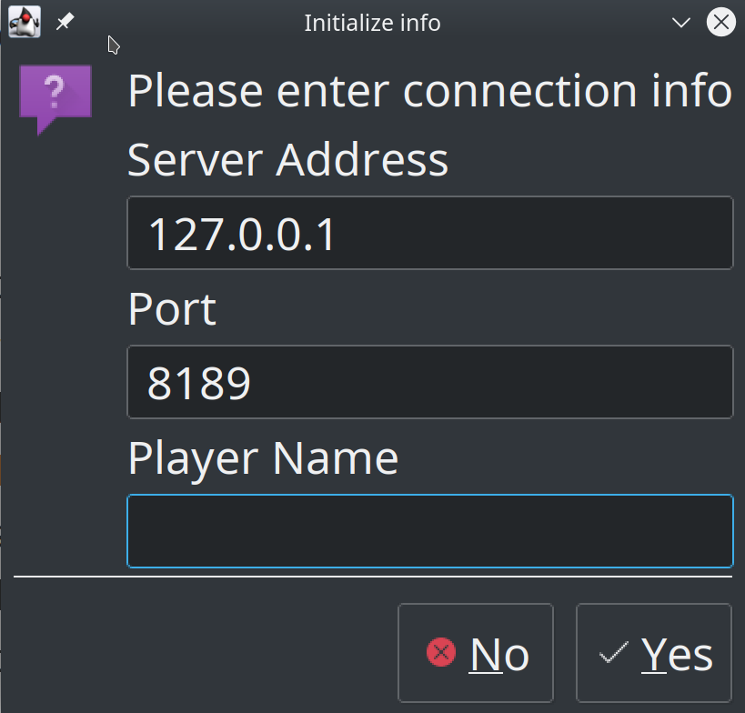

# Manual  

This is the user manual of Conway Game of Life simulator.  
You may find detail program usage and error message explanation here.

# CLI

## Examples Args  

Please replace `...` with commands corresponed to your OS specify in `readme.md`.

```bash
... tests/example1.txt tests/result/example1 21
... tests/example2.txt tests/result/example2 5
... tests/example3.txt tests/result/example3 50
```

### Linux Example

Here is how linux system should run the args, an example.

```bash
sh scripts/run.sh
sh scripts/run.sh tests/example1.txt tests/result/example1 21
sh scripts/run.sh tests/example2.txt tests/result/example2 5
sh scripts/run.sh tests/example3.txt tests/result/example3 50
sh scripts/run.sh tests/invalid1.txt tests/result/example1 1
sh scripts/run.sh tests/invalid2.txt tests/result/example1 1
sh scripts/run.sh tests/invalid3.txt tests/result/example1 1
sh scripts/run.sh tests/invalid4.txt tests/result/example1 1
sh scripts/run.sh tests/invalid5.txt tests/result/example1 1
sh scripts/run.sh tests/invalid5.txt tests/result/example1 -1
```

### Bad Examples  

```bash
... tests/invalid1.txt tests/result/example1 1
Err: [seedFile] Invalid row/col, must be positive integer larger than 2
... tests/invalid2.txt tests/result/example1 1
Err: [seedFile] Invalid row/col, must be positive integer larger than 2
... tests/invalid3.txt tests/result/example1 1
Err: [seedFile] Unexpected cell type 2
... tests/invalid4.txt tests/result/example1 1
Err: [seedFile] Unexpected col length at row index 1
... tests/invalid5.txt tests/result/example1 1
Cannot invoke "String.split(String)" because "<local1>" is null
... tests/example3.txt tests/result/example1 -1
Err: [input] step -1 is invalid
```

## Screenshot

Here is an example screenshot of how it looks like when program runs, we will talk about each arguments in the following sections. 


### Basic Usage

If incorrect/missing arguments given, the following message will occur.

```bash
$ sh scripts/run/sh                                            
Args: <input> <output> <step>
```

## Inputs  

In this section, program usage will be presented, as well as input file format.

### Command line  

Please refer to `readme.md`, looking for commands for your OS. Here each argument will be explained in details.

#### `<input>`

The path to the seed file. The file format is defined below.

##### Input File format  

- The first line contains, in order, the number of rows, and the number of columns in the grid, separated by a comma and a space. E.g., 5, 7 means that there are 5 rows and 7 columns in the grid. There are no spaces after the number of columns.
- All lines starting from the second one contain the state of one row in the grid, starting with row #0. The state of each cell is designated with either 0 (cell is dead) or 1 (cell is alive). The states of individual cells are separated by a comma followed by a space (there is no comma and/or space after the last 0 or 1 in the line). For example, if the third line of the file (the second line of the grid part of the file) is 0, 0, 0, 1, 0, 0, 0 it corresponds to the following cell states in row[1]: row[1][0], row[1][1], row[1][2], row[1][4], row[1][5], and row[1][6] are dead, and row[1][3] is alive.
- All lines end with the new line character.

###### Example  

```
5, 7
0, 0, 0, 0, 0, 0, 0
0, 0, 0, 1, 0, 0, 0
0, 0, 0, 1, 1, 1, 1
1, 0, 0, 0, 1, 1, 1
1, 1, 1, 1, 1, 1, 1
```

You may find more examples under `tests/` folder.

#### `<output>`

The path to the directory where results should be stored. If the directory does not exist, program will generate all necessary parent directories. Each file inside the directory will follow the following format: 

```
<seedFilename>.<currentStep>.txt
```

The `currentStep` will be started from `0`, the origin seed file, and will end in given `<step>` parameter.

##### Output File Format  


The output file example may be found at `tests/result/`. The format of the file is the same as the input file.


#### `<step>`  

The number of step the simulation should run. This should be a positive integer.

## Errors  

Here we have listed some possible errors when using the program and what could you do when you have encountered them.
We have also provided some good and bad examples in next section.

### `Err: [io] Output path must be a directory`  

The specified `<output>` exists and is not a directory. Please specify another available location.

### `Err: [io] Failed to create output directory`  

The specified `<output>` does not exist, but program failed to create corresponded parents directories. Sometimes it may be system error, but please ensure the path enter is valid for your current OS.

### `Err: [input] step x is invalid`  

This happened when step is less than 0. Please specify a number equal to or larger than 0.

### `An error occur while processing files: `  

An `IOException` occurs. Possibly due to non-existence of a specified file, or other system issue. Please read stack for more info.

### `Err: [input] unable to parse "x" as integer`  

Either seed file row/col or step is not a valid integer representation. Please double check your input. 

### `Err: [seedFile] unable to identify row/col of the map`  

The first line of the seed file doesn't follow the `row, col` format and can't be parsed.

### `Err: [seedFile] Invalid row/col, must be positive integer larger than 2`  

Row or column integer representation in the seedFile is invalid.

### `Err: [seedFile] Unexpected col length at row index x`  

When reading seed file, a row is missing some cell representation. Please check if your file is corrupted.

### `Err: [seedFile] Unexpected cell type x`  

When reading a specific cell in the seed file, program cannot recognize its status. Please refer to file format section for the correct types.

### `Cannot invoke "String.split(String)" because "<local1>" is null`  

Seed file is possibly empty. Please check if correct seed file is given.

# GUI

## Starting GUI

To start GUI, follow the command in `README.md` and when you see console appears: `Starting GUI...`. The application has now started. It may take a while for the application window to show.

## Basic Usage

The appearance of the Application may varies on different platforms. For example, on Linux, it may look like this: 


On Windows:



The functionality should be the same, however. 

### Simulation status

The bottom line of the application indicate whether the simulation is in progress. For example, on the graph above, the simulation is `Ready to Start`, once you have tried to go to other stage (by clicking `<<` or `>>` on the top, type number on the box between the buttons), the status will changed into `simulation in progress...`. The cell status will update in real time you switch to different stage/map

### Change cell status

There are two ways to change map status:

- Load file using File menu on the top
- Manually click the map

Each of the block is clickable, and you may toggle the cell status (live or dead). However, this action can only be done before the simutaion has started. You will see a warning if you tried to change the stage when simulation is in progress. 

**Notice: You may find cell survival time > current tick index, that's because App counts initial LIVE cell with 1 tick survival time**


#### Set as Begin

However, if you still want to edit the map, you may use the button `Set as Begin` on the toolbar located on the left side of the map. This function will set the current map as a new round of simulation so that you can edit the map and run the simulation from that point. 

**Notice: this action will clear all survival times, previous maps, etc. and only keeps the cell statuses.**


#### Reset

If you want to reset the map but keeps the map row/col, click the button and a blank map will be set

#### New Map

If you want to manually set the map, click the button and enter the row and col you want accordingly. It will create an empty map with given size for you. Please note that all existing cell/map data will be destroyed.

### Load&Save

You may also load and save the result for future usage. You may find these actions under `File` Menu.

The file format could be found above #CLI Input section

#### Load file

When you click `Open file...`, a dialog will appear and ask for the file you want to load. If the file you choose cannot be loaded, an error message will appear 


You may consult #CLI Error section for more info

#### Save file

When you click `Save Current map as...`, a dialog will ask for name and location to save the file. 

`Save range of maps as...`, however, will prompt a sub panel, asking for more information. Please type the start range and end range accordingly.


##### Filename format

Since there may be multiple files generated at this point, to avoid overwriting result, string `%1d` in the filename format will be replaced with map index. 

Click save button and choose a directory. Please be sure the directory **does not** contain other files with names that has the same output pattern, or it might be overwritten. 

You may change the range save multiple different range. Once you have done, simply close the window by clicking the X on the top right.


### Configuration

You may change the UI of the application by editing configuration. To open configuration panel, you may use the `Settings` button on the toolbar, or the `Configuration` button under `Actions` menu. 


#### Colors

You may change the color of based on cell status, and the text color over it. Simply click the color blocks on the right column, and a color chooser will appear. 

Once you have decided a color, click ok, and you may find the map appear changed at the same time.

#### Survival Time

Click the checkbox to toggle number on the cell. You may find there is an update delay when there are many cells. 

#### Shade Level

If a cell is surviving a long time, its color will get darker and darker. However, to avoid color being too dark and hard to distinguish, the Shade level here will categorize cells' survival time, and the total ticks passed. If the cell has survived most of the ticks, it will be X times darker than the new cells, where X is the setting value. The less the lighter (E.g. X - 1 times, but stop at 1). This value only defines the maximum it can reach.

When the value is 1, no shade will apply. This number must be a positive number, or a warning will appear.

---

Once you have finished set up, you may close the configuration by clicking X on the top right. **Your changes will be saved immediately after you have changed the value. For text field, please press ENTER to confirm your decision.**

### Typing and number

For shade level and ticks to go to, the input box accept a number. **Please press enter to confirm** and if the input given cannot be parsed as a valid number, a warning will be given. Please double check your input and try again.


## Extra Tips

### Toolbar can be dragged away from the main panel

By holding the gray bar on the left side panel, you may drag the panel to another desire location and expand your working space.


If you want to restore the layout, simply click the X you the right top, and it will go back to the main frame.

### Survival time emitted

Sometimes you may find that the cells' survival time cannot fit the UI and won't show correctly. In this case, you may hover your mouse to the cell and its exact number will appear.


### Slow initialization time

When the program is generating maps (new map, loading file), it might be slow to response. Please be patient. 

After initialization, it is expected to have faster response time. The suggested size of the map is no larger than (200x200)
