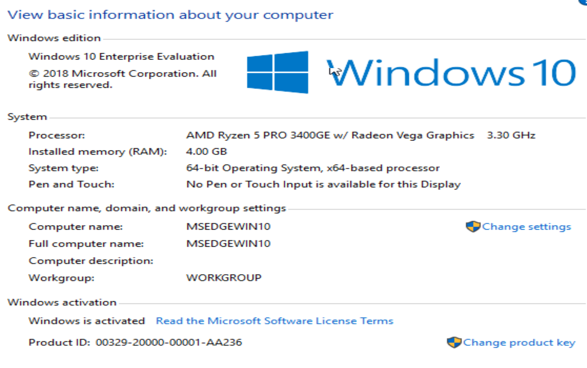
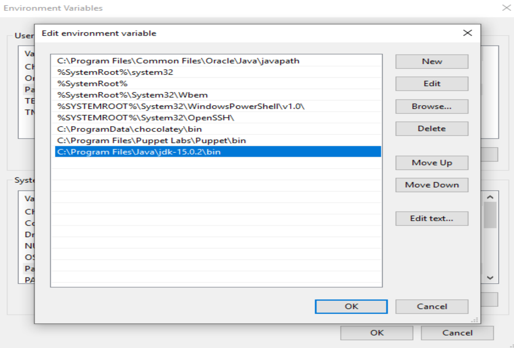

# Conway Game of Life

## Environment

Code and scripts are tested under with following settings.

### Linux 

#### Distribution

NixOS https://nixos.org

```bash
$ uname -a
Linux home-thinkcenter 5.4.90 #1-NixOS SMP Sun Jan 17 13:05:38 UTC 2021 x86_64 GNU/Linux
```

#### JDK

```bash
$ javac --version
javac 15.0.1
$ java --version
openjdk 15.0.1 2020-10-20
OpenJDK Runtime Environment (build 15.0.1+0-adhoc..jdk15u-jdk-15.0.1-ga)
OpenJDK 64-Bit Server VM (build 15.0.1+0-adhoc..jdk15u-jdk-15.0.1-ga, mixed mode, sharing)
```

#### Nix

If you have `Nix` installed, you may use `nix-shell` and it will set up development environment for you. 

### Windows

Virtualbox (Oracle VM VirtualBox VM Runner v6.1.16) used.

https://modern.ie Image from https://developer.microsoft.com/en-us/microsoft-edge/tools/vms/

#### Distribution



#### JDK

```powershell
PS C:\Users\IEUser> javac --version
javac 15.0.2
PS C:\Users\IEUser> java --version
java 15.0.2 2021-01-19
Java(TM) SE Runtime Environment (build 15.0.2+7-27)
Java HotSpot(TM) 64-Bit Server VM (build 15.0.2+7-27, mixed mode, sharing)
```

#### Note for javadoc

By default, installation from Java won't add javadoc to path. Please add Java bin path to `Control Panel -> System and Security -> System -> Advance System Setting -> Environment Variables -> Path` with your install path so the script can work properly.




### 

## Usage

The following command are happened under project root directory

### Linux

#### Compile

```bash
sh scripts/compile.sh
```

#### Run

```bash
sh scripts/run.sh <input> <output> <step>
```

### Windows

Open the powershell and nevigate to the project root directory

#### Compile

```cmd
.\scripts\compile.cmd
```

#### Run

```cmd
.\scripts\run.cmd <input> <output> <step>
```


## Others

Please consult `manuals/` for more info