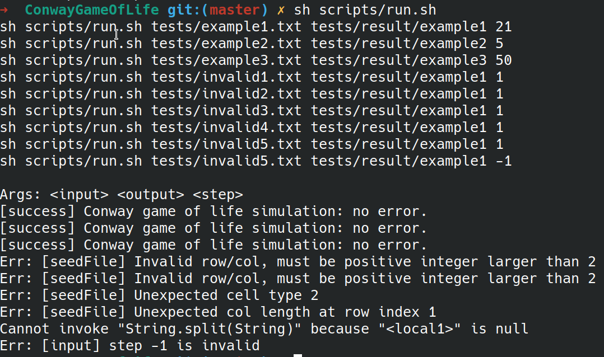

# Manual  

This is the user manual of Conway Game of Life simulator.  
You may find detail program usage and error message explanation here.

## Examples Args  

Please replace `...` with commands corresponed to your OS specify in `readme.md`.

```bash
... tests/example1.txt tests/result/example1 21
... tests/example2.txt tests/result/example2 5
... tests/example3.txt tests/result/example3 50
```

### Linux Example

Here is how linux system should run the args, an example.

```bash
sh scripts/run.sh
sh scripts/run.sh tests/example1.txt tests/result/example1 21
sh scripts/run.sh tests/example2.txt tests/result/example2 5
sh scripts/run.sh tests/example3.txt tests/result/example3 50
sh scripts/run.sh tests/invalid1.txt tests/result/example1 1
sh scripts/run.sh tests/invalid2.txt tests/result/example1 1
sh scripts/run.sh tests/invalid3.txt tests/result/example1 1
sh scripts/run.sh tests/invalid4.txt tests/result/example1 1
sh scripts/run.sh tests/invalid5.txt tests/result/example1 1
sh scripts/run.sh tests/invalid5.txt tests/result/example1 -1
```

### Bad Examples  

```bash
... tests/invalid1.txt tests/result/example1 1
Err: [seedFile] Invalid row/col, must be positive integer larger than 2
... tests/invalid2.txt tests/result/example1 1
Err: [seedFile] Invalid row/col, must be positive integer larger than 2
... tests/invalid3.txt tests/result/example1 1
Err: [seedFile] Unexpected cell type 2
... tests/invalid4.txt tests/result/example1 1
Err: [seedFile] Unexpected col length at row index 1
... tests/invalid5.txt tests/result/example1 1
Cannot invoke "String.split(String)" because "<local1>" is null
... tests/example3.txt tests/result/example1 -1
Err: [input] step -1 is invalid
```

## Screenshot

Here is an example screenshot of how it looks like when program runs, we will talk about each arguments in the following sections. 



### Basic Usage

If incorrect/missing arguments given, the following message will occur.

```bash
$ sh scripts/run/sh                                            
Args: <input> <output> <step>
```

## Inputs  

In this section, program usage will be presented, as well as input file format.

### Command line  

Please refer to `readme.md`, looking for commands for your OS. Here each argument will be explained in details.

#### `<input>`

The path to the seed file. The file format is defined below.

##### Input File format  

- The first line contains, in order, the number of rows, and the number of columns in the grid, separated by a comma and a space. E.g., 5, 7 means that there are 5 rows and 7 columns in the grid. There are no spaces after the number of columns.
- All lines starting from the second one contain the state of one row in the grid, starting with row #0. The state of each cell is designated with either 0 (cell is dead) or 1 (cell is alive). The states of individual cells are separated by a comma followed by a space (there is no comma and/or space after the last 0 or 1 in the line). For example, if the third line of the file (the second line of the grid part of the file) is 0, 0, 0, 1, 0, 0, 0 it corresponds to the following cell states in row[1]: row[1][0], row[1][1], row[1][2], row[1][4], row[1][5], and row[1][6] are dead, and row[1][3] is alive.
- All lines end with the new line character.

###### Example  

```
5, 7
0, 0, 0, 0, 0, 0, 0
0, 0, 0, 1, 0, 0, 0
0, 0, 0, 1, 1, 1, 1
1, 0, 0, 0, 1, 1, 1
1, 1, 1, 1, 1, 1, 1
```

You may find more examples under `tests/` folder.

#### `<output>`

The path to the directory where results should be stored. If the directory does not exist, program will generate all necessary parent directories. Each file inside the directory will follow the following format: 

```
<seedFilename>.<currentStep>.txt
```

The `currentStep` will be started from `0`, the origin seed file, and will end in given `<step>` parameter.

##### Output File Format  


The output file example may be found at `tests/result/`. The format of the file is the same as the input file.


#### `<step>`  

The number of step the simulation should run. This should be a positive integer.

## Errors  

Here we have listed some possible errors when using the program and what could you do when you have encountered them.
We have also provided some good and bad examples in next section.

### `Err: [io] Output path must be a directory`  

The specified `<output>` exists and is not a directory. Please specify another available location.

### `Err: [io] Failed to create output directory`  

The specified `<output>` does not exist, but program failed to create corresponded parents directories. Sometimes it may be system error, but please ensure the path enter is valid for your current OS.

### `Err: [input] step x is invalid`  

This happened when step is less than 0. Please specify a number equal to or larger than 0.

### `An error occur while processing files: `  

An `IOException` occurs. Possibly due to non-existence of a specified file, or other system issue. Please read stack for more info.

### `Err: [input] unable to parse "x" as integer`  

Either seed file row/col or step is not a valid integer representation. Please double check your input. 

### `Err: [seedFile] unable to identify row/col of the map`  

The first line of the seed file doesn't follow the `row, col` format and can't be parsed.

### `Err: [seedFile] Invalid row/col, must be positive integer larger than 2`  

Row or column integer representation in the seedFile is invalid.

### `Err: [seedFile] Unexpected col length at row index x`  

When reading seed file, a row is missing some cell representation. Please check if your file is corrupted.

### `Err: [seedFile] Unexpected cell type x`  

When reading a specific cell in the seed file, program cannot recognize its status. Please refer to file format section for the correct types.

### `Cannot invoke "String.split(String)" because "<local1>" is null`  

Seed file is possibly empty. Please check if correct seed file is given.