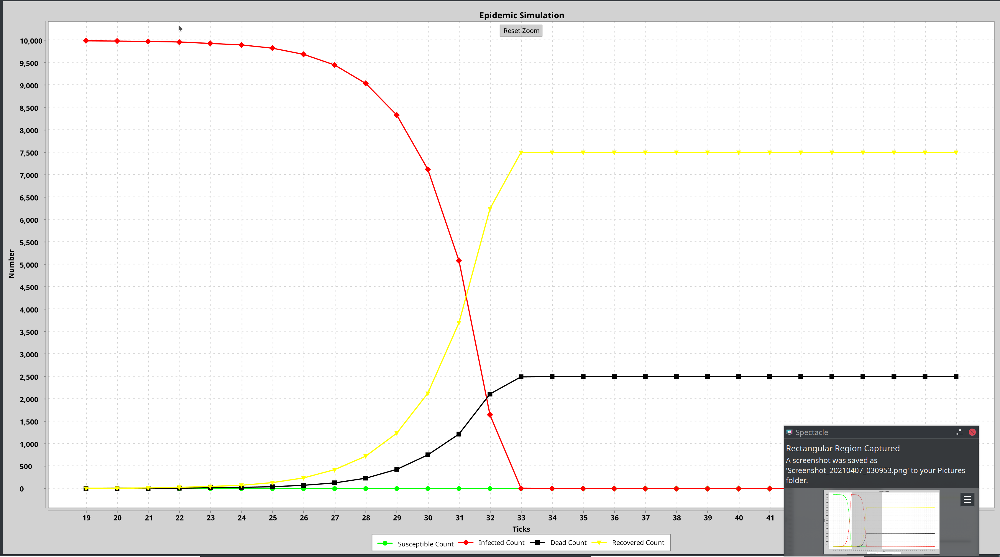

# Manual 
 
This is the user manual for Epidemic Simulation. 
You may find detail program usage and error message explanations here.
 
# GUI
 
## Starting GUI
 
To start GUI, follow the command in `README.md`. It may take a while for the application window to show.
 
## Basic Steps
 
### Load a graph
 
In order to start simulation, a graph is needed to be imported
 

 
Click on the "File" menu on the top to load graph.
 

You may find this notice if loaded successfully:

#### File format

Currently, we support csv files with format of edge list and adjancent list, separated by comma. More details about the format can be find at https://gephi.org/users/supported-graph-formats/csv-format/.

### Choose infection mode

After loaded the graph, you should choose an infection mode from the toolbar on the left side before start(or the simulation will do nothing). There are three different modes:

- Random N Infect: Random N nodes are marked as infected.
- Degree S Infect: All nodes with degree greater than S are marked as infected. Degree is defined as the number of edges incident to a node.
- BFS K Infect: A single random node is selected as a seed infected node and then the breadth first search (BFS) algorithm is run from that seed node until K total nodes (including the seed node) are visited. Then all these K nodes are marked as infected.

**Notice: to change these parameters, please check Configuration section**

You will see the following message if action is done:

### Start Simulation
 
You may now click the start button and the simulation will run to the defined tick in the configuration panel. The default is 100 ticks.

 
The graph will update in real time (once the tick result is available), and you may also check for the simulation status (infection count, recovered count, tick, etc.) from the status bar at the bottom of the UI. These statuses also update in real time.

You may also pause the simulation at any time, and click start to resume the simulation. Reset button will set the graph to the origin, no infection is made so you may need to choose the infection mode again once you press reset.
 
#### Take a closer look at the data

The graph is presented in the follow way:

- X-axis: ticks
- Y-axis: number of nodes

There will be four line with different styles to represent different counts. You may find each of their meaning by looking at the legend of the graph at the bottom. 

You may zoom in a peticular data range via select-dragging over a range on the X-Axis

 
To reset the view, click the button in the middle of the graph

You may also acquire exact number of a specific point by hang over it 

 
### Configuration
 

 
You may find the configuration panel by the `Settings` button on the left panel or from the menu.

**Notice: All parameters will won't be effective on paused simulation, and will be effective after reset (if applicatble)**
 
#### Colors

**Notice: Color changes will only be effective on next restart.**

You may change the color of each of the counts
 
#### N, S, K

Parameters control initial infection, please check `Choose infection mode` for more details

#### D

The possibility a node dies after infection. On the other hand, node will recover with probability `1 - d`. A dead node is removed from the graph along with all its edges.

D should be a double between 0-1

#### T

The number of ticks a node will stay in the state of infection

T should be an integer larger than

#### Lambda

The number of susceptible neighbors of an infected node that will become infected in the next tick is determined such that the force of infection (the rate at which susceptible nodes become infected) approaches the lambda parameter of the simulation. We define the force of infection as the number of susceptible neighbors of currently infected nodes that become infected in the next tick divided by the number of currently infected nodes.

If the determined number of susceptible nodes that will become infected is greater than or equal to the number of susceptible neighbors of an infected node, all susceptible neighbors will become infected. Otherwise, exactly the determined number of susceptible neighbors will become infected. Specific susceptible neighbors that become infected are selected at random.

#### Seed

The seed for random number generator, used to decide random node or recovered possibility, etc.

#### Number of Thread

Number of thread used for the simulation. It is recommended to use the number of available cores on your computer. The available number is shown as well for your reference.

#### Number of Step

The number of step the simulation should run.

---
 
Once you have finished set up, you may close the configuration by clicking X on the top right. **Your changes will be saved immediately after you have changed the value. For a text field, please press ENTER to confirm your decision.**
 
### Typing and number
 
For the input box to accept a number. **Please press enter to confirm** and if the input given cannot be parsed as a valid number, a warning will be given. Please double check your input and try again.
 
## Error Messages
 
Some possibly error may be shown in the console as it is hard to decide its causes. Please save them if you encounter any for later diagnoise, if you have issue using the software.

For file/graph loading issue, please double check your format and retry.
 
### Limitations
 
Currently, there are some limitation/inconsistency you may find during simulation
 
#### Large file

If the file is really large, it may take a while for program to process. Please wait patiently until the success notice pop out.
 
#### Not respond to pause

You may find the pause does not work if you are doing some really large calculation. In order to keep data integraty, program will pause before next tick, so it will wait until current tick has finished calculation.