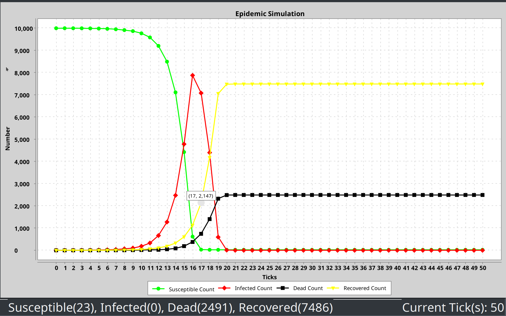
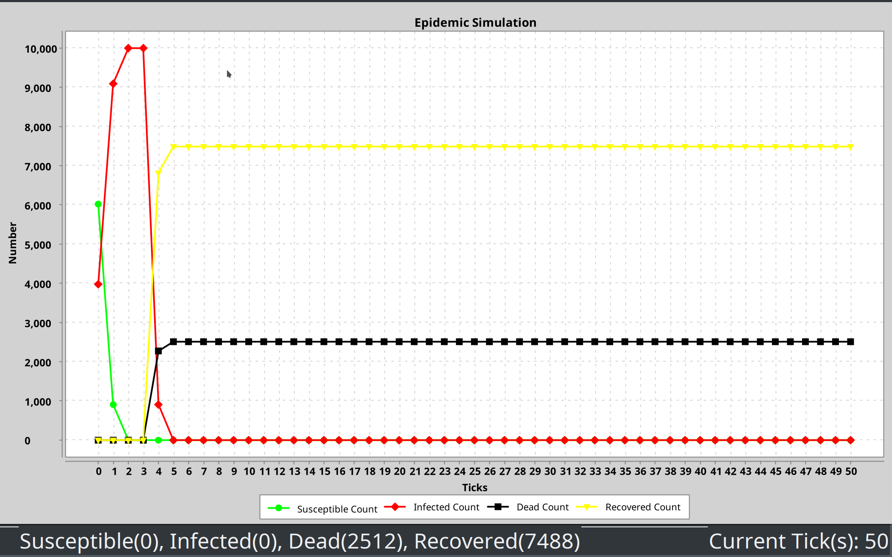
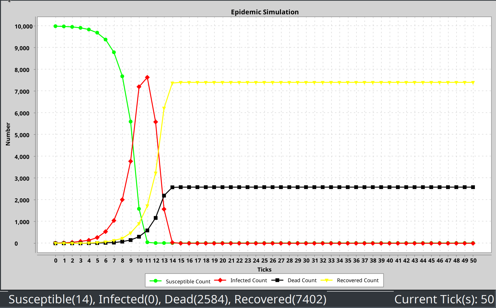
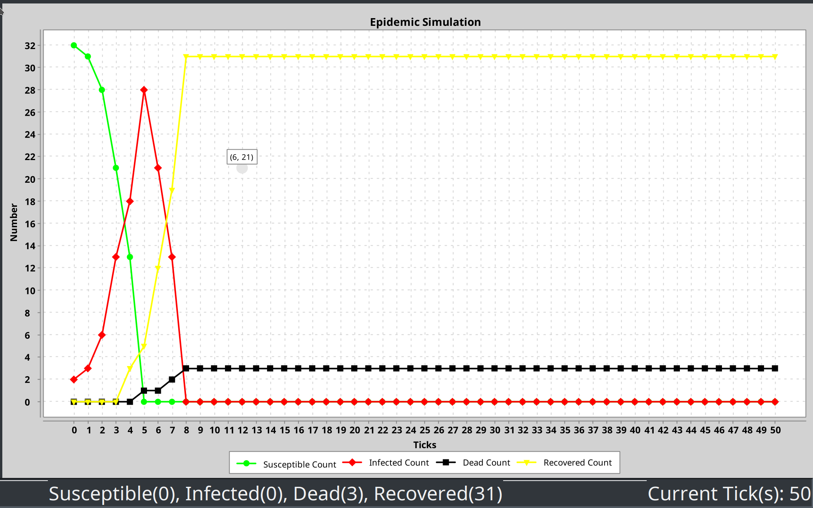
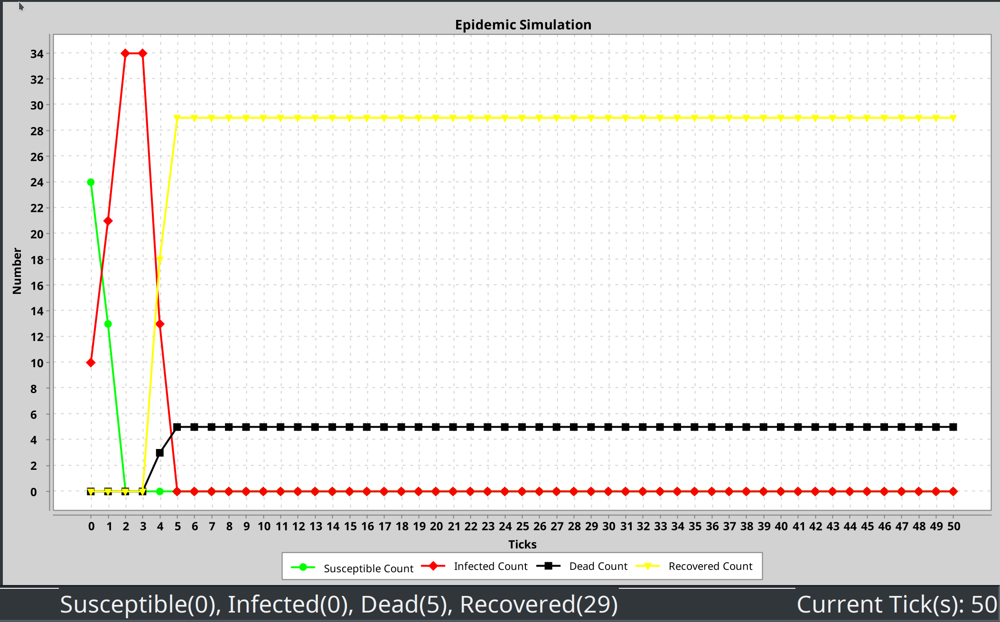
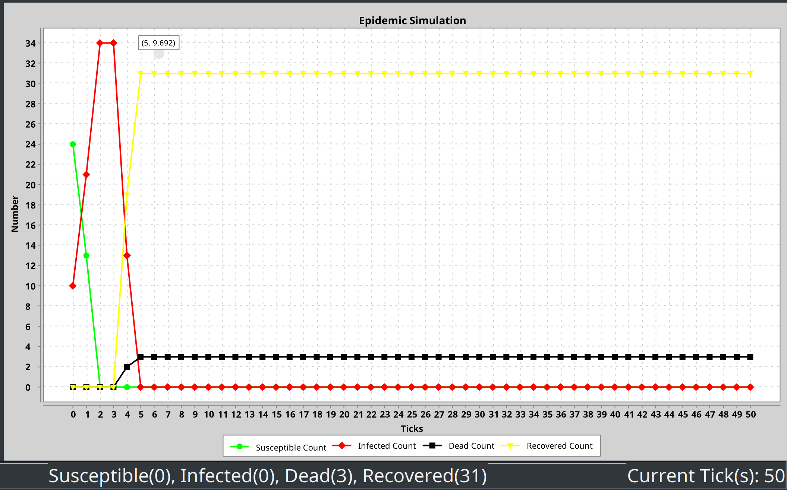

# Tests
 
The following methods are used when testing the program.
 
## Test plan
 
The underlying data representation will be mainly tested by the unit test. For the GUI part, it is mostly focused on whether the data bindings are working, or if target behaviors are reached. 
 
## Test strategy
 
### Unit Test
 
A Java framework, JUnit5, has been used within the process. You may consult `com.luox6.epidemic.test` for the written test cases.
 
#### Testing scenarios
 
##### Node
 
Node represents an individual on the graph
 
- correctly represent node status (Susceptible, Infected, Dead, Recovered)
- be able to count infected ticks
- equality implementation
 
##### Graph
 
Graph represents an ongoing simulation
 
- correctly record the nodes relationship
- be able to load relationship from String pairs
- correctly update current simulation count
 
##### Data Collection

Data Collection takes a graph and record count changes over time (by ticks)

- be able to load and get graph data
- be able to record data over iteration
- be able to update data on initialization
 
The above have tested model class's construction, mutations, etc.
 
##### Run Unit Test
 
You may use your favourite IDE integration with JUnit. Please consult [JUnit manual](https://junit.org/junit5/docs/current/user-guide/#running-tests)
However, if you would like to use `ConsoleLauncher`, after compiling the program following the instruction in `readme.md`, try the following command under project root directory for unit test result.
 
```bash
$ sh scripts/test.sh
```
 
or windows platform
 
```cmd
.\scripts\test.cmd
```
 
Please consult `test-log.txt` for the complete log.
 
### Manual Test
 
However, the unit test cannot cover some corner cases, e.g.:
 
- Network Protocol
- IO/Input validation
- GUI functionality
- Concurrency

#### Testing scenarios  
 
##### Main Frame
 
- extended to maximum size
- color of the lines on graph are corresponded to configration panel
 
##### Load Graph
 
- be able to load graph and its update main frame accordingly
- show error message on error (file format issue)
 
##### Toolbar
 
- show error if button clicked before graph loaded
- init infected mode will pop error if pressed mutiple times/different modes selected
- graph updated after mode selection
- start button will run simulation and update main frame in real time
- pause button will pause simulation on next click
- reset button will reset all infections and the main frame accordingly
 
Notice:
 
- update might be fast so that not each tick is visible to be observed
 
##### Configuration
 
- setting persistence (after application closed)
- color setting update will be effective after restarting the program
- parameter changes applied after pressing reset on current simulation
 
##### Warnings
 
- at any time, textfields that expected number but failed to parse will give warning
- at any time, if the action of textfield failed, the value will be restored to its previous value


#### Concurrency 

As the program involves random and concurrency, it won't always produce the same result with the same input. In order to partially workaround this issue, there are test data in the `./test` folder within manual folder, as well as their expected result. 

It is expected that the image won't be exactly as the result images in the result folder, but the tendency of the line and ticks should be close. 

parameters:

- N: 2
- S: 4
- K: 10
- D: 0.25
- T: 3
- Lambda: 1.25
- Seed: 96169

##### BAn10000m3.edges - Random N

Example: 




##### BAn10000m3.edges - Degree S

Example: 




##### BAn10000m3.edges - BFS K

Example: 




##### Zachary.edges.csv - Random N

Example: 




##### Zachary.edges.csv - Degree S

Example: 




##### Zachary.edges.csv - BFS K

Example: 


