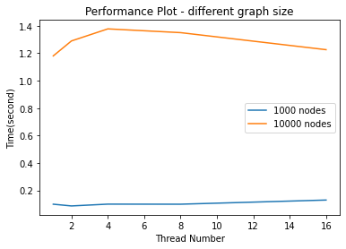
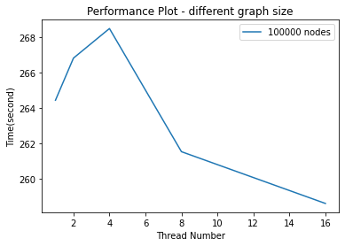

# Experiment Report

## Simulation Algorithm Analysis

Before each simulation:

- load graph
- set infection mode

For each simulation, there will the following steps:

- adjust dead/recovered node by removing them from the graph
- get all possible infected nodes
- infect node according to lambda and neighbour list
- tick all nodes

In the following algorithm analysis:

- V: number of vertices/nodes
- E: number of edges
- c: average number of neighbors per each node
- i: average number of infected nodes per each step
- s: average number of susceptible nodes per each step 
- n: number of threads

1. The graph construction requires reading through a file containing the adjacency
list, and it requires `O(E)`

2. The graph contains a HashMap storing nodes' names as keys and HashSets storing the edges. Also, there will be a HashMap with `name-Node` object pair to update status. Thus, constructing the graph requires `O(Vclog(c))`

3. When selecting the initial infected modes:
    - Random selection from all nodes by randomly generate integers and go via HashMaps's entry order. `O(V)` at most.
    - Degree K method requires `O(V)` to iterate through the nodes.
    - BFS method requires `O(V+E)`, depends on the `k` parameters as well

4. Within each step, the first step is to check if any infected nodes should recover
or die, and then remove it from the infected nodes list. That requires `O(i)` for
average cases.

5. Finding the susceptible neighbors requires `O(V * i)` since the connection is storing in a HashMap and we loop through all of the infected nodes and add them up.

6. Random choose from the neighbors in each step by generating an random number and identity its possibility. As we are using pseudo random, the generation would take `O(1)`, while we loop thru all susceptible node `O(s)`

7. Thus the total complexity for each step of simulation becomes `O(V * i + s)`,
and the number of infected nodes depends on the total number of nodes, while the number of susceptible node depends on lambda

## Data

|Graph size, nodes/edges/etc.|Name|Ticks|
|--|--|--|
|1,000|Random_n1000_p0.05.edges.csv|1000|
|10,000|BAn10000m3.edges.csv|50|
|100,000|Random_n100000_p0.0005.edges.csv|50|

|Graph size, nodes/edges/etc.|# of threads|Time, s|
|--|--|--|
|1,000|1|0.099034|
|1,000|2|0.086420|
|1,000|4|0.099596|
|1,000|8|0.099034|
|1,000|16|0.129375|
|10,000|1|1.180612|
|10,000|2|1.289690|
|10,000|4|1.377647|    
|10,000|8|1.350268|
|10,000|16|1.225976|
|100,000|1|264.433870|
|100,000|2|266.809695|
|100,000|4|268.477748|
|100,000|8|261.531911|
|100,000|16|258.611423|

**Note: file loading time, initial seed time, and GUI update time are excluded**

## Plot 

### Plot Analysis

For smaller graph (e.g. 1000 nodes), it is found that the larger the thread number, the slower it will be. This is possibly because the overhead of dividing and dispatching tasks is more than the benefits of multi-threading.

As the size of the graph grow larger, the overall time has increased. It is understandable since our runtime depends on the number of nodes and average number of neighbours. However, we find that the more thread we have, the less time we will use. It means that right now the overhead of multi-threading is less than the gain of manipulating multiple nodes at this moment.

However, it is observed that the runtime of the same input/parameters can lead to different results. Since the experiment uses random N nodes as initial infection mode, it may lead to different computation as well. Further experiments with fix infection mode may provide more reliable data points.