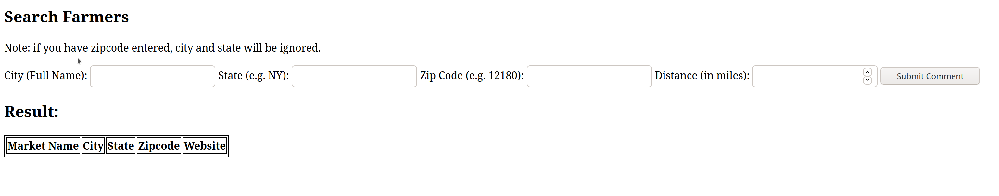
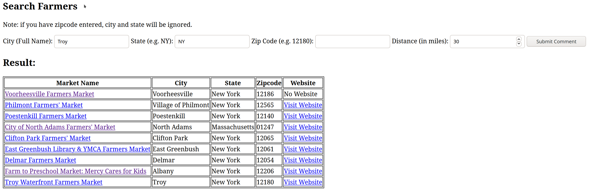

# Manual 
 
This is the user manual for Farmer Market Web App
 
## Get started

After successfully started the application, please open up your browser and type in the address. E.g. `http://localhost:8080/`. This address may change if a different configuration is used. Please adjust accordingly

### Main Page
 
The following welcome page will should up
 

 
Click an action link, and it will lead to corresponded page.

### View all Farmers

 
All farmers will be shown in the page. You may find the Information E.g. `City`, `State`, `Zipcode` and `Website` directly in the table.

For better browsing experience, each page will only show 25 farmers. You may view more by clicking the `Next Page` link at the end of the table, and `Previous Page` to go back. Your current page will also display as a reference.

The Average Rating is calculated based on the comments left by users. For more information, you may click the corresponded market name which will lead you to the detail page. 

 
#### Detail Page
 
You may find more details on detail page. E,g, `Street`, `Latitude`. 

You may also leave your comments by filling your name and choose a rating between 1 and 5. You may also leave an optional description about your rating here. When you finished, click `Submit Comment`. 

 
If you see this message, your comment has successfully recorded. The page will refresh automatically and reflect your changes.
 

 
Note: same name can only leave one comment for one farmer. Currently, we do not support edit or delete comments.

You may see this kind of error if you have already left a comment.
 
### Search Farmers

Search page required either `City` and `State`, or `Zip Code` to pinpoint a location as the search center. Distance is always required and should larger or equal to 0.

However, if a `Zip Code` is provided, it will always be used instead of `City` and `State`. If an invalid zip code provided, the following error message will be shown:

Here is an example result page with `Troy, NY` and distance `30`

 
Please note that the result using zip code will be sorted from nearest to farthest. However, `City, State` search won't. This is because there may be multiple center points (County) within range of `City`.

## Tips
 
- You may always use `go back on page` function in your browser to go back to previous page. 
- You may share the url of the current page (detail, search) to others if you would like them to check out farmers.